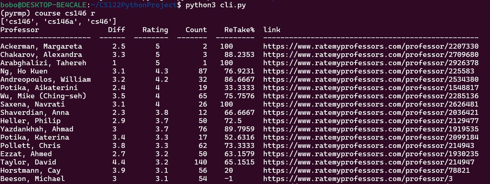
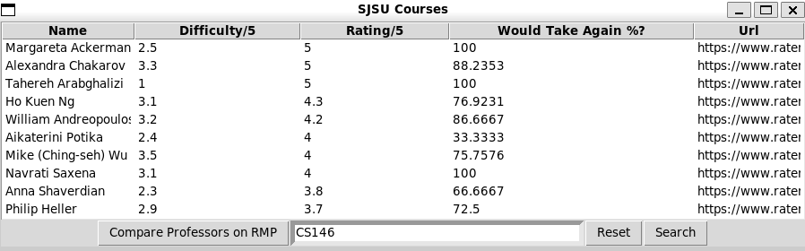

RateMyProfessor CLI

Team Name: “Insert Team Name”

Raymond Lin: raymond.z.lin@sjsu.edu, Austin Trinh: xuanhuy.trinh@sjsu.edu, David Le: david.le05@sjsu.edu

Problem:
The course catalog only has search criteria with course name and professor, without ratings. RateMyProfessor has rating data, but only allows you to search up to one professor at a time, which is tedious and inconvenient for comparing professors. There is no method to search many professors simultaneously with sorted rating information.

Functionality:
We will use a web scraper to gather data on RateMyProfessor and the SJSU catalog. With this data, we will create a Command Line Interface with commands that allow users to search for courses based on course name, rating, and professor. The user can then sort this data by rating or course, allowing people to compare professors more quickly. This application will cover the area of Web Scraping and Data Analysis.

Running:

Install `tabulate` (for CLI only):
```bash
# you may need to create a virtual environment
python -m venv venv
source venv/bin/activate
# install tabulate
pip install tabulate
```

Then run either the CLI or GUI:

```bash
python cli.py
python gui.py
```

GUI instructions:

The searchbar at the bottom allows you to search by classes. Type in your query and press the searchbar. To reset the
query, you can clear the searchbar and press enter or press the "Reset" button.

You can click an item to select it. You can control+click or shift+click to select multiple items. Once selected you can press the Compare button to open
the professors on RateMyProfessor.

CLI instructions:

See help.txt. 

Snapshots of program:

CLI:

GUI: 


Previous Works:

https://github.com/Rodantny/Rate-My-Professor-Scraper-and-Search:

This project allows you to get RMP data for one professor at a time.

https://github.com/LucasStevenson/SJSU-RMP-Class-Search:

This project is effectively the same as what we’re describing, but it has a website interface, and does not sort search results.

High-Level Approach:
We will send an HTTP GET request to https://www.sjsu.edu/classes/schedules/spring-2024.php to gather course catalog information, and build a scraper to get information from RateMyProfessors. Our command line interface will process this data to return sorted search results to users.

Dependencies:

[Tabulate](https://pypi.org/project/tabulate/)
